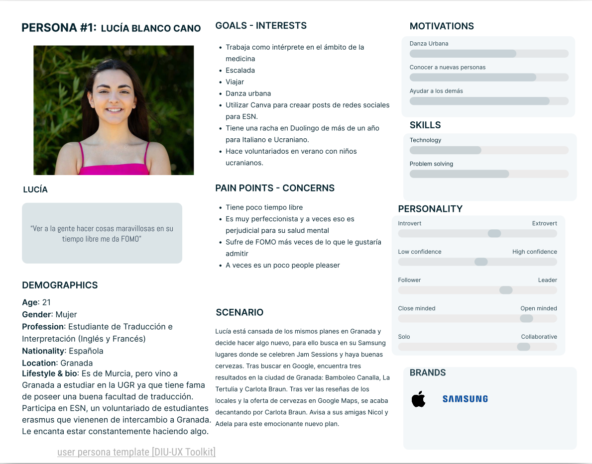
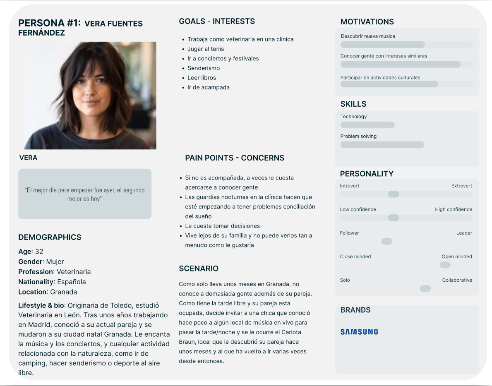
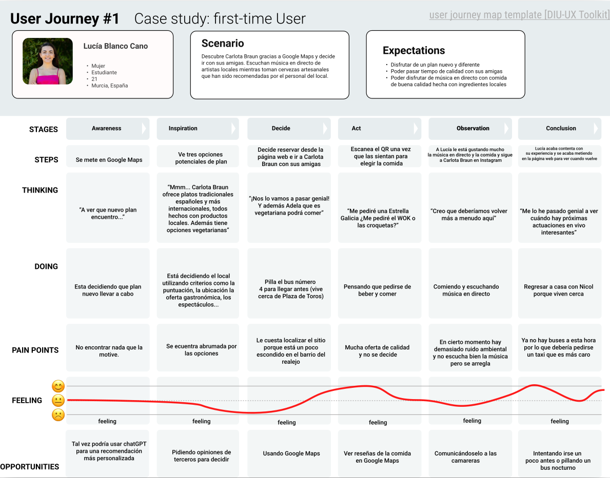
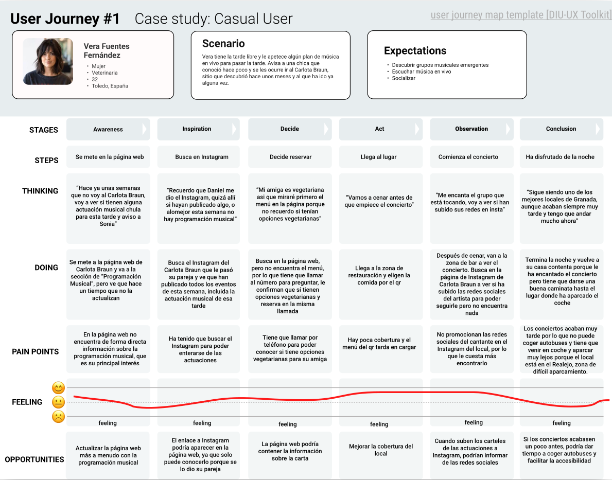
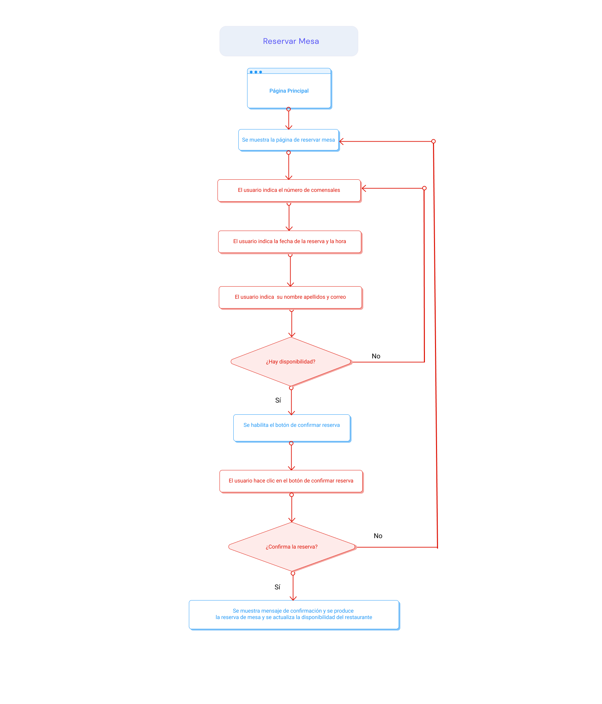
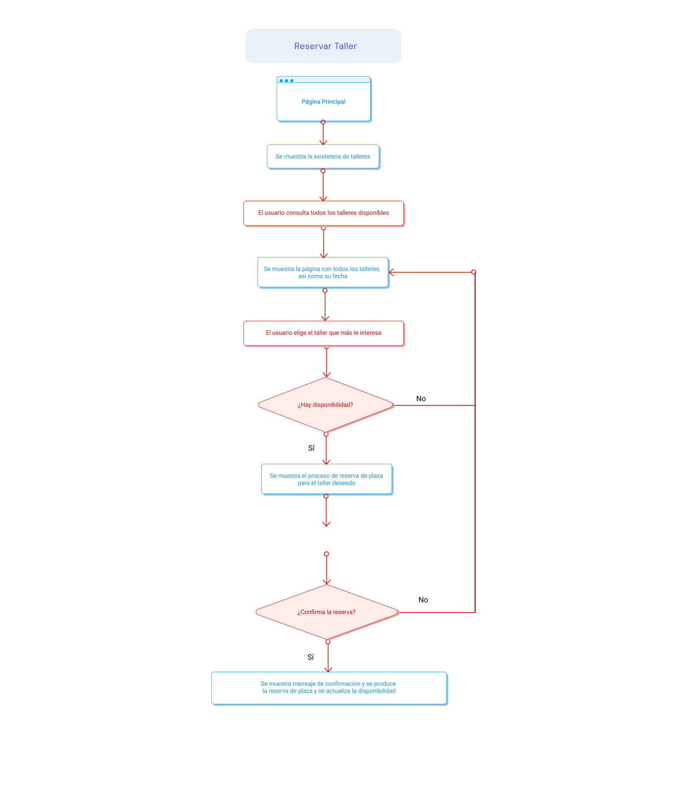
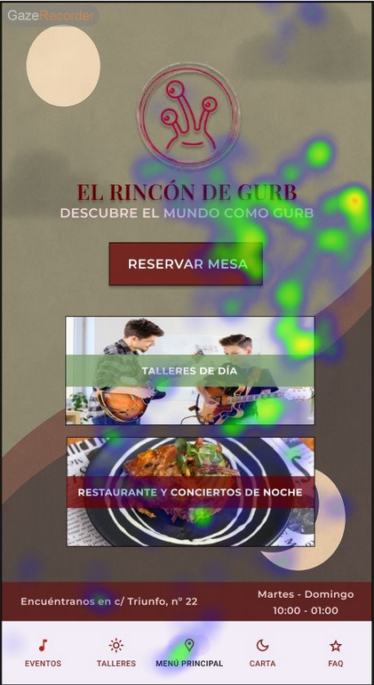
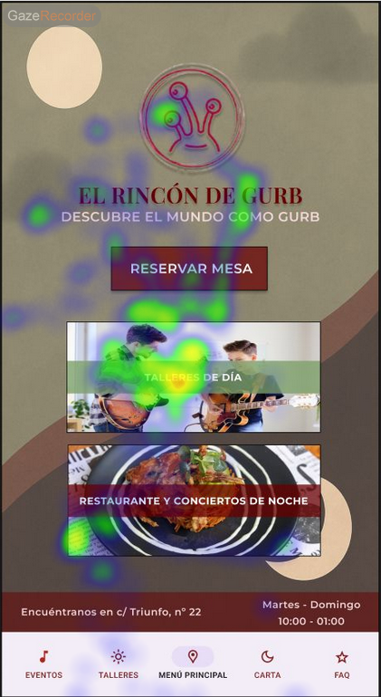
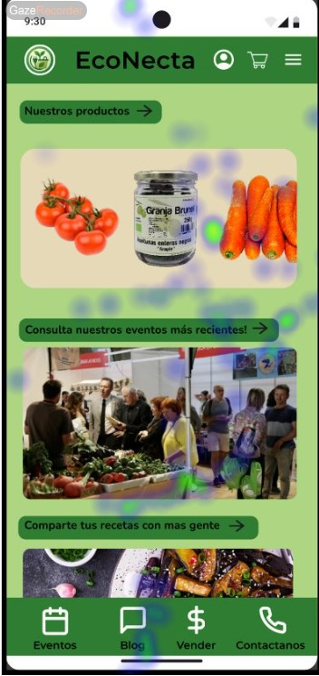
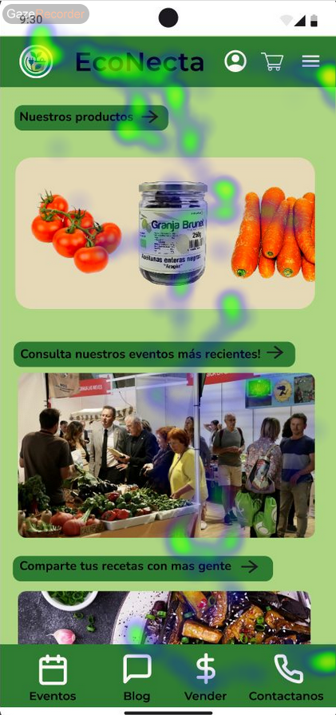

# DIU25
Prácticas Diseño Interfaces de Usuario (Tema: Comercio Sostenible 2024/2025 ) 

[Guiones de prácticas](GuionesPracticas/)

Grupo: DIU2.PG².  Curso: 2024/25 

Actualizado: 21/03/2025

Proyecto: 

El Rincón de Gurb

Descripción: 

El Rincón de Gurb es un local alternativo y underground en la ciudad de Granada donde por la mañana se llevan a cabo diferentes talleres de todo tipo, como de escritura creativa, para aprender a tocar instrumentos, aprender a bailar, etc y por la tarde-noche es un local donde la gente puede pedir cervezas artesanales elaboradas en la ciudad de Granada con ingredientes locales y donde se celebran Jam Sessions, conciertos, recitales de poesía, actuaciones de danza, etc. En dicho local hay un personal encantador  siempre dispuesto a ayudar y el local es un entorno seguro y agradable.

Logotipo: 

Miembros:
 * :bust_in_silhouette:  Pablo García Alvarado     :octocat:https://github.com/pablovegood/     
 * :bust_in_silhouette:  Paula García Ipiña     :octocat:https://github.com/paulaipina/

----- 

# Proceso de Diseño 

 

## Paso 1. UX User & Desk Research & Analisis 

### 1.a User Reseach Plan
 
-----
La investigación de usuarios de un sistema es fundamental en el estudio de la experiencia de usuario. Para ello, se detalla un plan con el motivo de la investigación y la información que debemos recopilar, así como una descripción de las personas que van a formar parte del estudio. Para la investigación, se pueden seguir principalmente dos enfoques: actitudinal (lo que los usuarios dicen) y conductual (cómo los usuarios se comportan).
En el caso de nuestra práctica, no hemos realizado un estudio de los usuarios siguiendo las metodologías habituales (entrevistas, estudios etnográficos, cuestionarios, etc.) por falta de recursos y tiempo. Pero hemos diseñado a nuestros usuarios pensando en personas que tengan motivaciones o necesidades que puedan encajar con el proyecto sobre el cual queremos realizar la investigación. Es por ello que nos hemos basado en personas reales que son habituales del tipo de local de nuestra investigación. Asimismo, hemos seleccionado dos personas con niveles de experiencia distintos que les pueden llevar a experiencias diversas. Después, hemos llevado a cabo “journey maps”, que nos permiten seguir el viaje de cada usuario en el uso de la interfaz en cuestión para detectar problemas que puedan encontrarse, relacionados con un mal diseño, y que nos permitirán recopilar la información para el análisis de la experiencia de los usuarios y la mejora de una interfaz.

### 1.b Competitive Analysis
 
-----
El local sobre el cuál hemos decidido desarrollar nuestro estudio es "Carlota Braun", un local que mezcla grastonomía con ocio y actividades culturas, principalmente actividades musicales. Hemos seleccionado este local porque es un sitio que conocemos y en cuyas actividades hemos participado anteriormente, lo que nos permite realizar nuestro estudio con un mayor conocimiento del lugar. Para el estudio de la competencia, hemos seleccionado "Bamboleo Canalla" y "La Tertulia", ambos locales de Granada

El análisis se encuentra en https://github.com/pablovegood/UX_CaseStudy/blob/master/P1/AnalisisCompetencia.pdf

### 1.c Personas
 
-----
Lucía Blanco Cano: Lucía es una persona real joven que tiene muchas inquietudes y a la que le gusta hacer muchos planes con sus amigos y amigas. Le gusta la música y los espectáculos de música en directo y de hecho hace danza urbana en sus ratos libres. Además le gusta ayudar a los demás y moverse en contextos interculturales aunque a veces antepone el bienestar de los demás al suyo propio. 
 
https://github.com/pablovegood/UX_CaseStudy/blob/master/P1/Persona1Imagen.png

Vera Fuentes Fernández: Vera fue elegida como persona ya que presenta el caso de una persona más adulta que tiene interés por actividades culturales diferentes y muy relacionadas con la música y es una persona que ha llegado hace poco tiempo a una ciudad nueva así que está motivada a conocer a gente de intereses similares por lo que este tipo de locales pueden ser muy atractivos para ella. 
 
https://github.com/pablovegood/UX_CaseStudy/blob/master/P1/Persona2Imagen.png

### 1.d User Journey Map
 
----
La experiencia de usuario de Lucía fue elegida ya que es un claro ejemplo de usuario que no tiene experiencia previa con Carlota Braun e interacciona con las diferentes interfaces del local desde la completa ignorancia. Considero que es una experiencia habitual ya que cualquier persona que vaya a ir a Carlota Braun por primera vez podría acabar teniendo una experiencia similar a la de Lucía. 
 
https://github.com/pablovegood/UX_CaseStudy/blob/master/P1/Persona1JM.png

La experiencia de usuario de Vera fue elegida porque es un ejemplo de usuario con algo de conocimientos previos sobre el local que, a pesar de saber dónde encontrar cierta información y conocer las interfaces, puede toparse igualmente con dificultades, como la falta de actualización de la programación musical en la página o la falta de una opción para poder ver la carta, todas debido al descuido de la página web. También mejorar algunos aspectos que mejoren la experiencia de usuario una vez en el local como, si vas a poner el menú en qr, asegurarte de tener una buena cobertura en el interior del local.
 
https://github.com/pablovegood/UX_CaseStudy/blob/master/P1/Persona2JM.png

### 1.e Usability Review
 
----
El "Usability Review" completo está realizado en: https://github.com/pablovegood/UX_CaseStudy/blob/master/P1/Usability-review.xls
La puntuación total que obtuvo la página tras nuestro análisis es de 75, o buena. La página tiene, por lo general, un diseño claro e intuitivo, aunque con varios aspectos a mejorar. El principal sería la forma de contacto, añadir una opción para volver a la página principal desde cualquier sección de la página y actualizar la información de la página más a menudo. Como puntos positivos, la página te guía muy fácilmente hacia cualquier tarea que el usuario quiera realizar o sección que quiera consultar y el formulario de reserva está muy bien diseñado, guiando bien al usuario y filtrando posibles errores.

 

## Paso 2. UX Design  

### 2.a Reframing / IDEACION: Feedback Capture Grid / EMpathy map 
 
----
En el siguiente diagrama hemos reunido los aspectos más destacados que sacamos como conclusión de la práctica anterior. Estos aspectos consisten en aquello que funciona adecuadamente en nuestro caso de estudio, el local Carlota Braun, las carencias, que son aquellos aspectos que deben cambiarse o mejorarse; preguntas que surgen en los usuarios al usar su interfaz de usuario o ideas que hemos podido reunir para una propuesta de proyecto mejorado.

 
  
El principal problema es una falta de atención a ciertos aspectos de la página que pueden parecer detalles pero determinan la conexión de los potenciales usuarios con el local, como el no subir la programación a la página de forma actualizada, no informando correctamente a los usuarios de los eventos del local, no tener enlaces a las redes sociales que funcionen, o no informando correctamente de todas las opciones gastronómicas del local (que consideramos relevante siendo un local que destaca principalmente como restaurante, y teniendo en cuenta la amplia variedad de dietas de hoy en día).
Es por ello que nuestra propuesta de valor es un rediseño del local, ya que parte de una buena base (página fácil de encontrar, buen diseño de reserva de mesa, buen diseño general de la página principal), mejorando aquellas partes que hemos considerado poco cuidadas y añadiendo, como propuesta nuestra a partir de las necesidades que hemos determinado del estudio de las personas usuarias, la organización de talleres culturales, para fomentar la creación de un lugar de encuentro donde desarrollar la creatividad en compañía.
Estas ideas, como hemos mencionado, parten también de los mapas de empatía creados a partir de las personas que ideamos en la práctica anterior como usuarias de nuestro caso de estudio, y sus mapas de experiencia.

Mapa de empatía de Lucía:

Mapa de empatía de Vera:

### 2.b ScopeCanvas

----
Para nuestro proyecto, que hemos llamado "El rincón de Gurb" (inspirados por ese deseo de nuestras personas de explorar el mundo, descubrir nuevos hobbies y conocer personas), hemos desarrollado la siguiente propuesta de valor:

### 2.b User Flow (task) analysis 
Hemos definido el Flow Task de Reservar Mesa y Taller en la página web del local de "El rincón de Gurb" para ello hemos considerado que sucede si por ejemplo no hubiese disponibilidad para el taller o para una mesa con unas características concretas (fecha, número de comensales, etc).

-----

-----

 
-----

### 2.c IA: Sitemap + Labelling 
 
----
La arquitectura de la información que hemos definido, así como los términos para el diálogo con el usuario, son los siguientes: 

Término | Significado     
| ------------- | -------
Eventos | botón que lleva a la página de Eventos de la página web
Talleres | botón que lleva a la página de Talleres de la página web
Menú | botón que lleva a la página del Menú de la página web
FAQ | botón que lleva a la página de preguntas frecuentes de la página web
Sobre Nosotros | botón que lleva a la página de About Us de la página web
Reservar Mesa | botón que lleva a la página de Reservar Mesa de la página web
Reservar un puesto | botón que lleva a la página de Reservar un Puesto de la página web para el taller junto al que se encontraba el botón
Nombre | campo de texto donde el usuario debe escribir su nombre
Apellidos | campo de texto donde el usuario debe escribir su(s) apellido(s)
Correo electrónico | campo de texto para que el usuario introduzca su correo electrónico

### 2.d Wireframes
 
-----
>>> El diseño del layout que hemos planteado para nuestra interfaz, usando figma como herramienta para su creación (concretamente la plantilla presente en DIU_Toolkit_Framework, en la página Wireframes), es el siguiente:
>>> 

 

## Paso 3. Mi UX-Case Study (diseño)

### 3.a Moodboard

-----

Para la paleta de colores hemos utilizado la siguiente página web https://coolors.co/ y hemos ido bloqueando los colores a medida que nos iban gustando hasta tener los 5 que veis en el moodboard. Como aesthetic queríamos darle las vibras de lugar alternativo donde poder aprender y ver música en directo mientras se disfruta de buenas cervezas. Por otro lado, como fuentes hemos usado 2, una para los títulos y otra para los subtitulos, siendo estas Playfair Display y Montserrat respectivamente. Para el logo hemos usado https://looka.com/logo-maker/ y básicamente en el logo sale un extraterretsre (Gurb) asomado a la ventana de su nave espacial ya que quiere este descubrir el mundo (a través de los talleres en los que aprenderá diversas cosas).

El moodboard no se puede usar como cabecera de Instagram, pero si que puede servir de inspiración para desarrollar dicha cabecera.

### 3.b Landing Page
 
----

Para la landing page hemos diseñado una stories de Instagram donde promocionamos la apertura del local "El rincón de Gurb" utilizando como reclamo una oferta de cerveza gratis, la stories utiliza la paleta de colores y las fuentes que ha sido utilizadas en el moodboard. por otro lado tenemos arriba el logo del local y elementos decorativos que transmitan las vibras del local (vino, notas musicales). Abajo después del anuncio de la cerveza gratis tenemos un botón que es un enlace a la página web para que los seguidores de Instagram puedan acceder a la página web e investiguen un poco sobre el sitio.

### 3.c Guidelines
 
----

Vamos a utilizar una bottom navigation bar ya que tenemos 5 menús y según las guidelines lo mejor es utilizar de 3-5 iconos (en nuestro caso 5). También, para la página de reserva de nuestra aplicación móvil, hemos hecho uso de un calendario y un reloj para la hora. Por otro lado todos los menús han tenido una cabecera que incluían el logo, el nombre del local y un icono de Instagram con un enlace directo a la red social. Para los títulos hemos usado "Playfair Display" como fuente y para los subtíttulos "Montserrat".

### 3.d Mockup
 
----

El mockup de nuestra propuesta se puede ver en el siguiente enlace: [Figma Mockup Hi-Fi](https://www.figma.com/design/qEAvO4wfxdnhAdQPc58HrS/Soter--Copy-?node-id=33-305&p=f&t=2OAWFslzGZ8tiGpf-0) Se puede ver como interactuaría el usuario con la interfaz.

<!-- Grupo 1 -->

  
  
  
  

<!-- Grupo 2 -->

  
  
  
  

<!-- Grupo 3 -->

  
  

### 3.e ¿My UX-Case Study?
 
-----

Básicamente, hemos hecho uso de Design Thinking a través del local de Carlota Braun para proponer una alternativa mejor y más innovadora llamada El Rincón de Gurb donde además de página web tiene aplicación móvil. Hemos utilizado Figma y Canva mayoritariamente. Además hemos publicado el Case Study en la página web que estás viendo a continuación.
 

## Paso 4. Pruebas de Evaluación 

### 4.a Reclutamiento de usuarios 

-----

El proyecto B de nuestro A/B Testing es "EcoNecta", un proyecto enfocado en conectar a las personas con la naturaleza, lo ecológico y sostenible, que permite a las personas interesadas participar de un comercio ecológico, y compartir sus recetas y experiencias con otras personas con intereses similares.
Repositorio de GitHub: 

Las personas seleccionadas para este estudio son las siguientes:

| Nombre del Usuario | Género/Edad | Ocupación  | Experiencia TIC | Personalidad                          | Plataforma       | Caso |
|--------------------|-------------|------------|------------------|----------------------------------------|------------------|------|
| Sofía              | mujer/20    | estudiante | avanzada         | introvertida                           | Aplicación Móvil | A    |
| Ana                | mujer/22    | estudiante | avanzada         | extrovertida                           | Aplicación Móvil | A    |
| Iván               | hombre/23   | estudiante | avanzada         | extrovertido                           | Aplicación Móvil | B    |
| Lorena             | mujer/20    | estudiante | avanzada         | Alegre, extrovertida pero algo tímida | Aplicación Móvil | B    |

### 4.b Diseño de las pruebas 
 
-----
Hemos diseñado varias pruebas para evaluar la usabilidad de ambas páginas, desde cuestionarios previos y posteriores al uso de la página, hasta pruebas que requieren completar una serie de objetivos típicos de cada tipo de local, además de una evaluación de en qué se fijan más los usuarios en la página principal de cada sitio web.
En resumen, las pruebas han sido:
  1. Cuestionario SUS.
  2. Test de usabilidad de Maze.
  3. Aplicación del método eye-tracking.

### 4.c Cuestionario SUS
 
----

Este método de evaluación de la usabilidad, desarrollado por John Brooke en 1986, consiste en 10 preguntas a responder usando una escala de likert de 5 valores. Es un sistema sencillo y ampliamente usado en la comunidad.
Para calcular la puntuación se siguen los siguientes pasos:
  1. Sumamos las puntuaciones de los enunciados impares y le restamos 5.
  2. Sumamos las puntuaciones de los enunciados pares y restamos ese total a 25.
  3. Finalmente, sumamos ambos resultados y lo multiplicamos por 2.5, obteniendo una puntuación de 0 a 100.

| Preguntas                                                                |  A1  |  A2  |  B1  |  B2  |
|--------------------------------------------------------------------------|------|------|------|------|
| 1. Creo que me gustaría visitar con frecuencia este website              |   4  |   5  |   2  |   3  |
| 2. Encontré el website innecesariamente complejo                         |   1  |   1  |   1  |   2  |
| 3. Pensé que era fácil utilizar este website                             |   5  |   4  |   5  |   4  |
| 4. Creo que necesitaría del apoyo de un experto para recorrer el website |   1  |   1  |   1  |   1  |
| 5. Encontré las funciones del website bastante bien integradas           |   4  |   4  |   4  |   3  |
| 6. Pensé que había demasiada inconsistencia en el website                |   2  |   2  |   1  |   3  |
| 7. Imagino que la mayoría de las personas aprenderían muy rápidamente    |      |      |      |      |
|    a utilizar el website                                                 |   5  |   4  |   5  |   4  |
| 8. Encontré el website muy grande al recorrerlo                          |   2  |   1  |   2  |   2  |
| 9. Me sentí muy confiado en el manejo del website                        |   5  |   5  |   5  |   3  |
| 10. Necesito aprender muchas cosas antes de manejarme en el website      |   1  |   1  |   1  |   1  |
|                                                                          |      |      |      |      |
| **Puntuación preguntas impares:**                                        |   18 |   18 |   16 |   12 |
| **Puntuación preguntas pares:**                                          |   18 |   19 |   19 |   16 |
| **Puntuación total:**                                                    |   90 | 92.5 | 87.5 |   70 |

### 4.d A/B Testing
 
-----
Además del cuestionario anterior, hemos desarrollado un test en Maze consistente en varias preguntas para conocer el contexto de la persona en relación al proyecto a evaluar, seguido de una serie de objetivos a realizar en el prototipo en figma, para finalizar con una serie de preguntas sobre su percepción de distintas áreas de la página tras haber completado los objetivos propuestos.

Test de Maze de "El Rincón de Gurb": 
Test de Maze de "EcoNecta": 

### 4.e Aplicación del método Eye Tracking 

----
La herramienta de Eye Tracking permite representar visualmente aquellos puntos de una página en los que más se fijan los usuarios, lo que permite determinar si los elementos verdaderamente importantes de nuestro proyecto realmente atraen la atención de los usuarios y permite guiarlos a través del uso de nuestra página.

Hemos aplicado el experimento tanto al caso A como al caso B y hemos obtenido los siguientes resultados:
 

  

  

  

### 4.f Usability Report de B
 
-----

# Usability Report

#### Evaluación de usabilidad del proyecto 

###  EcoNecta

###  30 de mayo 

### Realizado por:

Equipo DIU2.PG^2.
  - Paula García Ipiña
  - Pablo García Alvarado

## 1 DESCRIPCIÓN DEL WEBSITE
EcoNecta es un proyecto que pretende atraer a las personas interesadas por el comercio ecológico, no solo con el objetivo principal de comprar y vender productos, sino también creando una comunidad de personas interesadas por lo sostenible y lo ecológico, lo cual consiguen mediante la adición de un blog que permite a las personas compartir experiencias, opiniones y/o recetas.

## 2 RESUMEN EJECUTIVO
Nuestro reporte de usabilidad contiene las técnicas empleadas para analizar la usabilidad de una página web, junto con los resultados obtenidos por la evaluación de cada usuario participante, que nos permite extraer las conclusiones sobre el caso de estudio asignado.

## 3 METODOLOGIA 

#### Metodología de usabililidad
Para el estudio de la usabilidad hemos utilizado hasta tres técnicas distintas:
  1. Cuestionario SUS.
  2. Test de Maze.
  3. Técnicas de Eye-Tracking.

 
#### Test de usuarios: Participantes
Los participantes del estudio de usabilidad de "EcoNecta" han sido los siguientes:

| Nombre del Usuario | Género/Edad | Ocupación  | Experiencia TIC | Personalidad                          | Plataforma       | Caso |
|--------------------|-------------|------------|------------------|----------------------------------------|------------------|------|
| Iván               | hombre/23   | estudiante | avanzada         | extrovertido                           | Aplicación Móvil | B    |
| Lorena             | mujer/20    | estudiante | avanzada         | Alegre, extrovertida pero algo tímida | Aplicación Móvil | B    |

#### Resultados obtenidos
En la puntuación del análisis de usabilidad del cuestionario SUS, el caso B ha recibido como puntuaciones un 87.5 y un 70, lo que indica que en general la página cumple bastante bien los criterios de usabilidad. Analizando las puntuaciones dadas por los usuarios participantes, concluimos que la página es intuitiva y fácil de navegar, pero falla en conseguir atraer a los usuarios hacia el comercio ecológico.

En cuanto al análisis del Eye-tracker, los resultados son algo dispares de una persona a otra, pero ambos coinciden en una atención hacia la imagen situada arriba en el centro y, aunque menor, también en las otras imágenes y los botones. Una de las personas si se fijó bastante en el nombre y logo de la página, y ambas se fijaron algo en el menú de navegación inferior.

## 4 CONCLUSIONES 

#### Incidencias

* Una de las personas no recordaba la existencia de la sección de recetas tras haber completado la navegación de la página y ser preguntada por ella en el test de Maze.

#### Valoración 

* Fácil navegación de la página.
* La información es fácil de visualizar sin elementos distractivos o demasiado sobrecargados y con, en general, un buen contraste.
* Los menús están bien diseñados, con las secciones adecuadas y fáciles de identificar.

#### Recomendaciones y propuesta de mejoras: 

* Una interfaz con un diseño y estética más moderna y actualizada, para atraer más el público hacia el proyecto.
* Conseguir que en la página principal la atención se centre en un elemento más concreto que sea aquello que más se quiera destacar de la página.

#### Valoración de la prueba de usabilidad (self-assesment)
Esta práctica y el desarrollo y puesta en práctica de las distintas pruebas de usabiliadd nos ha servido para entender cómo personas ajenas a una página web interactúan con el sitio de manera distinta a como muchas veces aquellos que se dedican a desarrollar el proyecto pueden esperar. Esto permite detectar qué aspectos fallan y entender qué es mejorable tanto en nuestro proyecto como en otros, para tener una mejor compresión de cómo se consigue una buena usabilidad en una página para guiar al usuario al tiempo que le provocamos interés por nuestro proyecto.

 

## Paso 5. Exportación y Documentación 

### 5.a Exportación a HTML/React
 
----

>>> Breve descripción de esta tarea. Las evidencias de este paso quedan subidas a P5/

### 5.b Documentación con Storybook

----

>>> Breve descripción de esta tarea. Las evidencias de este paso quedan subidas a P5/

 

## Conclusiones finales & Valoración de las prácticas

>>> Opinión FINAL del proceso de desarrollo de diseño siguiendo metodología UX y valoración (positiva /negativa) de los resultados obtenidos. ¿Qué se puede mejorar? Recuerda que este tipo de texto se debe eliminar del template que se os proporciona 

